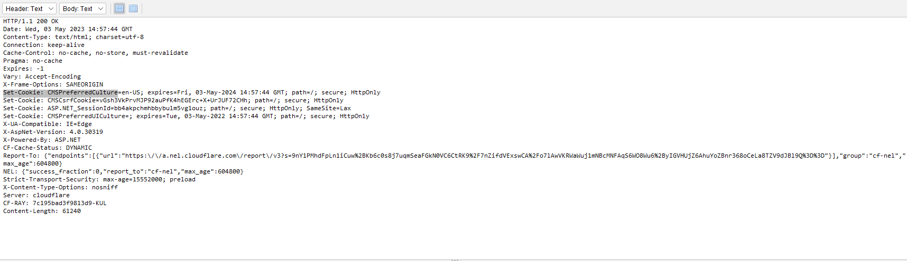
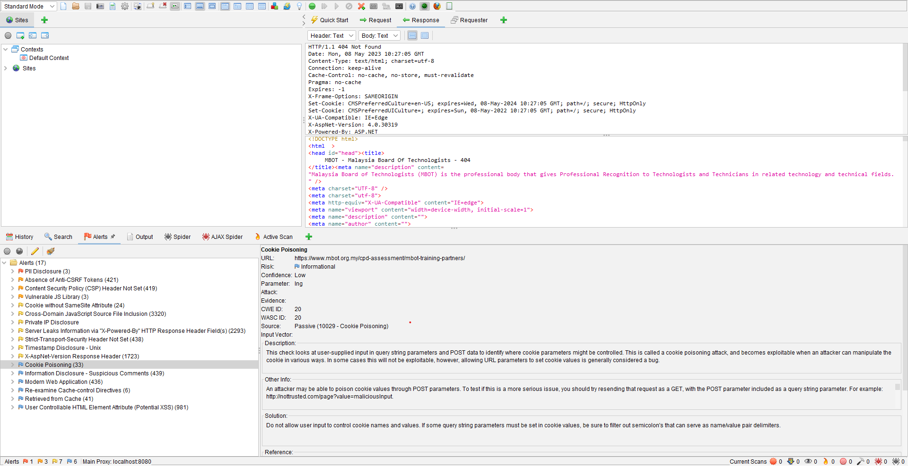

## Group Name: ADHD
## Group Members:
1. Muhammad Daniel Hakim Bin Mohd Suhaimi 2018451
2. Muhammad Hazim Bin Nor Aizi 2017455
3. Abu Zharr Luqman Bin Abdul Aziz 2011733
4. Muhammad Amiruddin bin Alias 2011349

## Assisgned Tasks for Group Members:
1. Server OS and Server-Side Scripting used(Windows or Linux, PHP or ASP.net or JavaScript, etc) : Amiruddin
2. Hash Disclosure                                                                               : Amiruddin
3. CSRF                                                                                          : Amiruddin
4. Secured Cookies                                                                               : Daniel
5. CSP                                                                                           : Daniel
6. JS Library                                                                                    : Hazim
7. HTTPS implementation(TL/SSL)                                                                  : Hazim
8. Cookie Poisoning                                                                              : Abu Zharr
9. Potential XSS                                                                                 : Abu Zharr
10. Information Disclosure                                                                       : Abu Zharr
11. Web Server Allows Password Auto-Completion                                                   : 
## Table of Contents
1. [Introduction](#introduction)
2. [Identify the vulnerabilities](#paragraph1)
    1. [Server OS and Server-Side Scripting used](#subparagraph1)
    2. [Hash Disclosure](#subparagraph2)
    3. [CSRF](#subparagraph3)
    4. [Secured Cookies](#subparagraph4)
    5. [CSP](#subparagraph5)
    6. [JS Library ](#subparagraph6)
    7. [HTTPS implementation](#subparagraph7)
    8. [Cookie Poisoning](#subparagraph8)
    9. [Potential XSS](#subparagraph9)
    10. [Information Disclosure](#subparagraph10)

3. [Evaluate the vulnerabilities](#paragraph2)
    1. [Server OS and Server-Side Scripting used](#subparagraph11)
    2. [Hash Disclosure](#subparagraph12)
    3. [CSRF](#subparagraph13)
    4. [Secured Cookies](#subparagraph14)
    5. [CSP](#subparagraph15)
    6. [JS Library ](#subparagraph16)
    7. [HTTPS implementation](#subparagraph17)
    8. [Cookie Poisoning](#subparagraph18)
    9. [Potential XSS](#subparagraph19)
    10. [Information Disclosure](#subparagraph20)

4. [Prevent the vulnerabilities](#paragraph3)
    1. [Server OS and Server-Side Scripting used](#subparagraph21)
    2. [Hash Disclosure](#subparagraph22)
    3. [CSRF](#subparagraph23)
    4. [Secured Cookies](#subparagraph24)
    5. [CSP](#subparagraph25)
    6. [JS Library ](#subparagraph26)
    7. [HTTPS implementation](#subparagraph27)
    8. [Cookie Poisoning](#subparagraph28)
    9. [Potential XSS](#subparagraph29)
    10. [Information Disclosure](#subparagraph30)

## Introduction<a name="introduction"></a>
The objective of this report is to conduct a case study upon the website https://www.mbot.org.my/ using OWASP ZAP. We first scan the website using traditional spider to get any alert or vulnerabilities that was assigned for us to check. After that we observe the additional information such as CWE ID and CVE ID.


## Identify the vulnerabilities <a name="paragraph1"></a>
We scan the website nusing ZAP to identify if there are any vulnerabilites in the website.
Here is the scan result:


### Server OS and Server-Side Scripting used <a name="subparagraph1"></a>

### Hash Disclosure <a name="subparagraph2"></a>
A hash was disclosed by the web server. - Mac OSX salted SHA-1

### CSRF <a name="subparagraph3"></a>

### Secured Cookies <a name="subparagraph4"></a>
After a thorough inspection, there are no alert for Secured cookies but another alert related to cookies was found which is Cookies Without Same Site Attribute.


A report regarding this alert is made such as below



This alert happened because of the cookie set in the website did not implement the SameSite Attribute resulting to cross-site request.

### CSP <a name="subparagraph5"></a>
After the scan, OWASP ZAP give alert about the CSP.


A report regarding this alert is made such as below


OWASP ZAP prompt this alert due to Content Security Policy (CSP) which is an added layer of security that helps to detect and mitigate certain types of attacks does not use or incorrectly uses a protection mechanism that provides sufficient defense against directed attacks against the product.

### JS Library <a name="subparagraph6"></a>

From our scan we identify a risk or vulnerable JS Library that may be a dangerous vulnerability for attacker to exploit. Below is the example and the type of Library that is outdated

-1.12.4/jquery.min.js
-Bootstrap v3.3.7 
-moment.js  version : 2.9.0
-* jQuery JavaScript Library v2.2.4
 
### HTTPS implementation <a name="subparagraph7"></a>

### Cookie Poisoning <a name="subparagraph8"></a>

The site is vulnerable to Cookie Poisoning. Cookie Poisoning, also known as session hijacking is an attack which alters, hijacks or in any way exploit the cookie of a targeted site to steal data and bypass security. 



### Potential XSS <a name="subparagraph9"></a>

The site is vulnerable to Cross Site Scripting (XSS). Cross Site Scripting (XSS) is an attack which exploit the vulnerabilities of the functionalities in a website. For example, if there is no Whitelisting (eg: Regular Expression) implemented, an attacker can inject malicious codes to gain access to sensitive information in a database. 


### Information Disclosure <a name="subparagraph10"></a>

### Web Server Allows Password Auto-Completion 
The remote web server contains at least one HTML form field that has an input of type 'password' where 'autocomplete' is not set to 'off'.

While this does not represent a risk to this web server per se, it does mean that users who use the affected forms may have their credentials saved in their browsers, which could in turn lead to a loss of confidentiality if any of them use a shared host or if their machine is compromised at some point.

Page : /member/registration/
Destination Page: /member/registration/

Page : /secure/login/
Destination Page: /secure/login/

## Evaluate the vulnerabilities <a name="paragraph2"></a>
After identifying vulnerabilities, we evaluate the vulnerabilities to decide the degree of risk of each vulnerabilities.

### Server OS and Server-Side Scripting used <a name="subparagraph11"></a>

### Hash Disclosure <a name="subparagraph12"></a>

CWE-200: Exposure of Sensitive Information to an Unauthorized Actor
The product exposes sensitive information to an actor that is not explicitly authorized to have access to that information.
This term is frequently used in vulnerability advisories to describe a consequence or technical impact, for any vulnerability that has a loss of confidentiality. Often, CWE-200 can be misused to represent the loss of confidentiality, even when the mistake - i.e., the weakness - is not directly related to the mishandling of the information itself, such as an out-of-bounds read that accesses sensitive memory contents; here, the out-of-bounds read is the primary weakness, not the disclosure of the memory. In addition, this phrase is also used frequently in policies and legal documents, but it does not refer to any disclosure of security-relevant information.

### CSRF <a name="subparagraph13"></a>

### Secured Cookies <a name="subparagraph14"></a>
According to https://cwe.mitre.org/ Cookies Without Same Site Attribute is listed as Sensitive Cookie with Improper SameSite Attribute with CWE ID 1275
Just as stated above this is due to the SameSite attribute for sensitive cookies is not set, or an insecure value is used. The cookie transmission for cross-domain requests is managed by the SameSite property. 'Lax', 'Strict', or 'None' are the three possible values for this characteristic. A website may send a cross-domain POST HTTP request to another website if the 'None' option is provided, and the browser will add cookies to this request. If there are no extra safeguards in place (such as Anti-CSRF tokens), this could result in Cross-Site-Request-Forgery (CSRF) attacks. 


However this vulnerability is listed as a simple structure, it is not difficult to prevent as it only involve Web Based. Thus this vulnerability is categorized as a low to medium risk due to its low likelihood.

| CIA | Risk    | CVSS    |
| :---:   | :---: | :---: |
| Medium | Low   | 0.0   |

### CSP <a name="subparagraph15"></a>

In https://cwe.mitre.org/ This flaw pertains to three different circumstances. When an application doesn't describe a mechanism to defend against a specific class of attack, it is said to be "missing" a protection mechanism. An "insufficient" protection system may offer some defences, such as those against the most frequent attacks, but it does not offer complete security. Last but not least, a mechanism is considered "ignored" when it is present and being used by the product but has not been implemented by the developer in some code path.

Content Security Policy (CSP) is an added layer of security that helps to detect and mitigate certain types of attacks, including Cross Site Scripting (XSS) and data injection attacks. These attacks are used for everything from data theft to site defacement or distribution of malware. CSP provides a set of standard HTTP headers that allow website owners to declare approved sources of content that browsers should be allowed to load on that page — covered types are JavaScript, CSS, HTML frames, fonts, images and embeddable objects such as Java applets, ActiveX, audio and video files.

In the https://www.cvedetails.com/ with ID CVE-2018-5164 they listed Confidentiality Impact as none, Integrity Impact as partial and Availability Impact as none. The vulnerability faced by the report is Cross Site Scripting.

The consequences if this vulnerability is exploit it could affect the technical impact of the access control which is Bypass Protection Mechanism.

| CIA | Risk    | CVSS    |
| :---:   | :---: | :---: |
| High | Medium   | 4.3   |

### JS Library <a name="subparagraph16"></a>
 
Class of threat

jquery, version 1.12.4


CVSS 3.x Severity and Metrics: NIST: NVDBase Score: 6.1 MEDIUM
CNA:  GitHub, Inc.Base Score: 6.9 MEDIUM

CVE-2020-11023
In jQuery versions greater than or equal to 1.0.3 and before 3.5.0, passing HTML containing <option> elements from untrusted sources - even after sanitizing it - to one of jQuery's DOM manipulation methods (i.e. .html(), .append(), and others) may execute untrusted code. This problem is patched in jQuery 3.5.0.

CVE-2020-11022  
In jQuery versions greater than or equal to 1.2 and before 3.5.0, passing HTML from untrusted sources - even after sanitizing it - to one of jQuery's DOM manipulation methods (i.e. .html(), .append(), and others) may execute untrusted code. This problem is patched in jQuery 3.5.0.

CVE-2015-9251

CVE-2019-11358

    
Bootstrap v3.3.7
    CVE-2019-8331
    CVE-2018-14041
    CVE-2018-14040
    CVE-2018-14042
    CVE-2016-10735
    
moment.js, version 2.9.0 is vulnerable 
    CVE-2017-18214
    CVE-2022-24785
    
jQuery JavaScript Library v2.2.4
    CVE-2020-11023
    CVE-2020-11022
    CVE-2015-9251
    CVE-2019-11358
    
### HTTPS implementation <a name="subparagraph17"></a>

### Cookie Poisoning <a name="subparagraph18"></a>

### Potential XSS <a name="subparagraph19"></a>

### Information Disclosure <a name="subparagraph20"></a>

### Web Server Allows Password Auto-Completion 
By tenable
    Severity: Low
    https://www.tenable.com/plugins/nessus/42057

## Prevent the vulnerabilities <a name="paragraph3"></a>
The last step is for us to suggest a way to prevent the vulnerabilities found from the scan.

### Server OS and Server-Side Scripting used <a name="subparagraph21"></a>

### Hash Disclosure <a name="subparagraph22"></a>
Ensure that hashes that are used to protect credentials or other resources are not leaked by the web server or database. There is typically no requirement for password hashes to be accessible to the web browser. 

### CSRF <a name="subparagraph23"></a>

### Secured Cookies <a name="subparagraph24"></a>
Set the 'Lax' or 'Strict' options for the SameSite attribute of a sensitive cookie. This gives the browser specific instructions to use this cookie exclusively for requests from the same domain, which offers strong Defence in Depth against CSRF attacks. Cookies are also delivered for top-level cross-domain navigation via HTTP GET, HEAD, OPTIONS, and TRACE methods when the 'Lax' value is in use, but not for other HTTP methods that are more likely to result in state mutation side-effects.

Here is the example of the code:
```
// Set a cookie with SameSite attribute
document.cookie = "myCookie=value; SameSite=Strict";

// Alternatively, you can set multiple attributes in one cookie using semicolons
document.cookie = "myOtherCookie=anotherValue; SameSite=Lax; Secure; HttpOnly";

```
### CSP <a name="subparagraph25"></a>
Ensure that your web server, application server, load balancer, etc. is configured to set the Content-Security-Policy header, to achieve optimal browser support: "Content-Security-Policy" for Chrome 25+, Firefox 23+ and Safari 7+, "X-Content-Security-Policy" for Firefox 4.0+ and Internet Explorer 10+, and "X-WebKit-CSP" for Chrome 14+ and Safari 6+.

### JS Library <a name="subparagraph26"></a>
The solution for all the outdated library is to stay updated to current version where it is patched to current security measure
### HTTPS implementation <a name="subparagraph27"></a>

### Cookie Poisoning <a name="subparagraph28"></a>

### Potential XSS <a name="subparagraph29"></a>

### Information Disclosure <a name="subparagraph30"></a>

### Web Server Allows Password Auto-Completion 
Add the attribute 'autocomplete=off' to these fields to prevent browsers from caching credentials.
