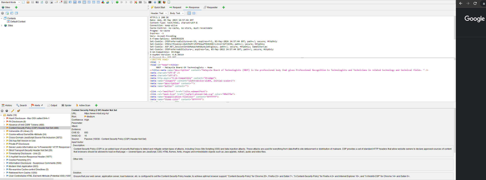
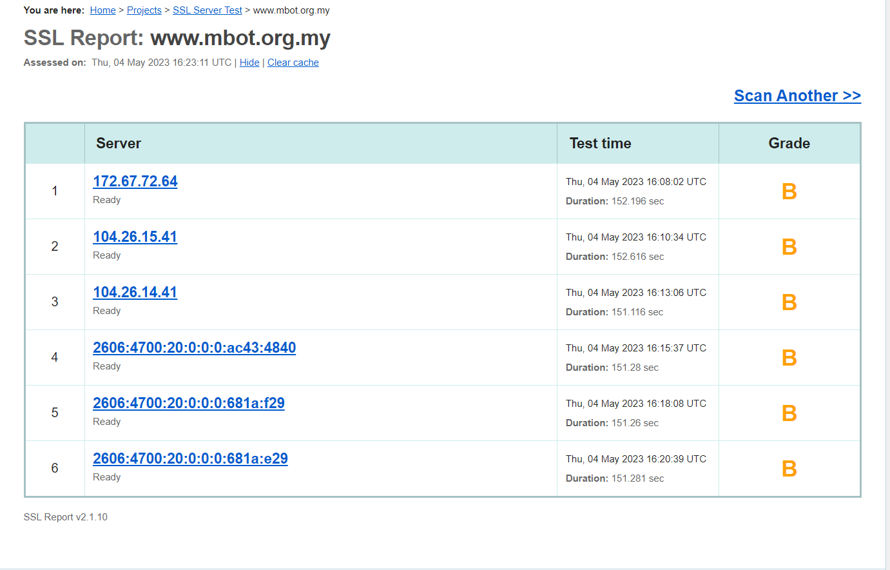

## Group Name: ADHD
## Group Members:
1. Muhammad Daniel Hakim Bin Mohd Suhaimi 2018451
2. Muhammad Hazim Bin Nor Aizi 2017455
3. Abu Zharr Luqman Bin Abdul Aziz 2011733
4. Muhammad Amiruddin bin Alias 2011349

## Tools used
1. ZAP
2. Nessus
3. SSL Server Test(website)
4. DnsChecker(website)
5. Dirbuster

## Assisgned Tasks for Group Members:
| No. | Task | Assigned    |
| :---:   | :---:   | :---: |
| 1   | Server OS and Server-Side Scripting used(Windows or Linux, PHP or ASP.net or JavaScript, etc) | Amiruddin   |
| 2   | Hash Disclosure | Amiruddin/Hazim   |
| 3   | CSRF | Amiruddin   |
| 4   | Secured Cookies | Daniel   |
| 5   | CSP | Daniel   |
| 6   | JS Library | Hazim   |
| 7   | HTTPS implementation(TL/SSL) | Hazim/Daniel   |
| 8   | Cookie Poisoning | Abu Zharr   |
| 9   | Potential XSS | Abu Zharr   |
| 10   | Information Disclosure | Abu Zharr   |
| 11   | Web Server Allows Password Auto-Completion | Hazim   |
| 12   | Setting and prepare md documentation | Daniel   |

## Table of Contents
## Table of Contents
| No. | Task |
| :---:   | :---:   |
| 1.0   | [Introduction](#introduction)|
| 2.0   | [Identify the vulnerabilities](#paragraph1)
|  2.1  |     [Server OS and Server-Side Scripting used](#subparagraph1)
|  2.2  |     [Hash Disclosure](#subparagraph2)
|  2.3  |     [CSRF](#subparagraph3)
|  2.4  |     [Secured Cookies](#subparagraph4)
|  2.5  |     [CSP](#subparagraph5)
|  2.6  |     [JS Library ](#subparagraph6)
|  2.7  |     [HTTPS implementation](#subparagraph7)
|  2.8  |     [Cookie Poisoning](#subparagraph8)
|  2.9  |     [Potential XSS](#subparagraph9)
|  2.10 |     [Information Disclosure](#subparagraph10)
|  2.11 |     [Web Server Allows Password Auto-Completion](#subparagraph31) |
| 3.0  | [Evaluate the vulnerabilities](#paragraph2) |
|  3.1  |     [Server OS and Server-Side Scripting used](#subparagraph11)
|  3.2  |     [Hash Disclosure](#subparagraph12)
|  3.3  |     [CSRF](#subparagraph13)
|  3.4  |     [Secured Cookies](#subparagraph14)
|  3.5  |     [CSP](#subparagraph15)
|  3.6  |     [JS Library ](#subparagraph16)
|  3.7  |     [HTTPS implementation](#subparagraph17)
|  3.8  |     [Cookie Poisoning](#subparagraph18)
|  3.9  |     [Potential XSS](#subparagraph19)
|  3.10 |     [Information Disclosure](#subparagraph20)
|  3.11 |    [Web Server Allows Password Auto-Completion](#subparagraph32)
| 4.0  | [Prevent the vulnerabilities](#paragraph3) |
|  4.1  |     [Server OS and Server-Side Scripting used](#subparagraph21)
|  4.2  |     [Hash Disclosure](#subparagraph22)
|  4.3  |     [CSRF](#subparagraph23)
|  4.4  |     [Secured Cookies](#subparagraph24)
|  4.5  |     [CSP](#subparagraph25)
|  4.6  |     [JS Library ](#subparagraph26)
|  4.7  |     [HTTPS implementation](#subparagraph27)
|  4.8  |     [Cookie Poisoning](#subparagraph28)
|  4.9  |     [Potential XSS](#subparagraph29)
|  4.10  |    [Information Disclosure](#subparagraph30)
|  4.11  |    [Web Server Allows Password Auto-Completion](#subparagraph33)

## Introduction<a name="introduction"></a>
The objective of this report is to conduct a case study upon the website https://www.mbot.org.my/ using OWASP ZAP and some other penetrat. We first scan the website using traditional spider to get any alert or vulnerabilities that was assigned for us to check. After that we observe the additional information such as CWE ID and CVE ID.


## Identify the vulnerabilities <a name="paragraph1"></a>
We scan the website nusing ZAP to identify if there are any vulnerabilites in the website.
Here is the scan result:


### Server OS and Server-Side Scripting used <a name="subparagraph1"></a>
Server OS used: Cloudflare


Server-side Scripting used: ASP.net version 4.0.30319


### Hash Disclosure <a name="subparagraph2"></a>
A hash was disclosed by the web server. - Mac OSX salted SHA-1

### CSRF <a name="subparagraph3"></a>
Absence of anti-CSRF tokens


### Secured Cookies <a name="subparagraph4"></a>
After a thorough inspection, there are no alert for Secured cookies but another alert related to cookies was found which is Cookies Without Same Site Attribute.


A report regarding this alert is made such as below


This alert happened because of the cookie set in the website did not implement the SameSite Attribute resulting to cross-site request.

### CSP <a name="subparagraph5"></a>
After the scan, OWASP ZAP give alert about the CSP.


A report regarding this alert is made such as below


OWASP ZAP prompt this alert due to Content Security Policy (CSP) which is an added layer of security that helps to detect and mitigate certain types of attacks does not use or incorrectly uses a protection mechanism that provides sufficient defense against directed attacks against the product.

### JS Library <a name="subparagraph6"></a>

From our scan we identify a risk or vulnerable JS Library that may be a dangerous vulnerability for attacker to exploit. Below is the example and the type of Library that is outdated


|  VULNERABLE JS LIBRARY       |
| -------------                |
|  1.12.4/jquery.min.js        | 
| Bootstrap v3.3.7             | 
| moment.js  version : 2.9.0   | 
|jQuery JavaScript Library v2.2.4 | 

 
### HTTPS implementation <a name="subparagraph7"></a>

After scan is made, it prompt oot SSL alert




### Cookie Poisoning <a name="subparagraph8"></a>

There are a total of 33 reports regarding Cookie Poisoning:


The https://www.mbot.org.my/ site is vulnerable to Cookie Poisoning. Cookie Poisoning, also known as session hijacking is an attack which alters, hijacks or in any way exploit the cookie of a targeted site to steal data and bypass security. 


For this site, the automated scan looks at user-supplied input in query string parameters and POST data to identify where cookie parameters might be controlled. This is called a cookie poisoning attack, and becomes exploitable when an attacker can manipulate the cookie in various ways. In some cases this will not be exploitable, however, allowing URL parameters to set cookie values is generally considered a bug. An attacker may be able to poison cookie values through POST parameters.

### Potential XSS <a name="subparagraph9"></a>

There are a total of 981 reports regarding Potential Site Scripting (XSS):


The https://www.mbot.org.my/ site is vulnerable to Cross Site Scripting (XSS). Cross Site Scripting (XSS) is an attack which exploits the vulnerabilities of the functionalities in a website. For example, if there is no Whitelisting (eg: Regular Expression) implemented, an attacker can inject malicious codes to gain access to sensitive information in a database or alter the contents of a website. Among the possible attacks are utilising Javascript code such as <script>alert(cookie)</script> to get the cookie of the website.


### Information Disclosure <a name="subparagraph10"></a>

There are a total of 517 reports regarding Information Disclosure:


The site is vulnerable to Information Disclosure. Information Disclosure happends when the site unintentionally reveals sensitive information to the users, in this case through the comments in the html and javascript code.


### Web Server Allows Password Auto-Completion <a name="subparagraph31"></a>
The remote web server contains at least one HTML form field that has an input of type 'password' where 'autocomplete' is not set to 'off'.

While this does not represent a risk to this web server per se, it does mean that users who use the affected forms may have their credentials saved in their browsers, which could in turn lead to a loss of confidentiality if any of them use a shared host or if their machine is compromised at some point.

Page : /member/registration/
Destination Page: /member/registration/

Page : /secure/login/
Destination Page: /secure/login/

## Evaluate the vulnerabilities <a name="paragraph2"></a>
After identifying vulnerabilities, we evaluate the vulnerabilities to decide the degree of risk of each vulnerabilities.

### Server OS and Server-Side Scripting used <a name="subparagraph11"></a>
The X-Powered-By header describes the technologies used by the webserver. This information exposes the server to attackers. Using the information in this header, attackers can find vulnerabilities easier.

### Hash Disclosure <a name="subparagraph12"></a>

CWE-200: Exposure of Sensitive Information to an Unauthorized Actor
The product exposes sensitive information to an actor that is not explicitly authorized to have access to that information.
This term is frequently used in vulnerability advisories to describe a consequence or technical impact, for any vulnerability that has a loss of confidentiality. Often, CWE-200 can be misused to represent the loss of confidentiality, even when the mistake - i.e., the weakness - is not directly related to the mishandling of the information itself, such as an out-of-bounds read that accesses sensitive memory contents; here, the out-of-bounds read is the primary weakness, not the disclosure of the memory. In addition, this phrase is also used frequently in policies and legal documents, but it does not refer to any disclosure of security-relevant information.

### CSRF <a name="subparagraph13"></a>
No Anti-CSRF tokens were found in a HTML submission form.
A cross-site request forgery is an attack that involves forcing a victim to send an HTTP request to a target destination without their knowledge or intent in order to perform an action as the victim. The underlying cause is application functionality using predictable URL/form actions in a repeatable way. The nature of the attack is that CSRF exploits the trust that a web site has for a user. By contrast, cross-site scripting (XSS) exploits the trust that a user has for a web site. Like XSS, CSRF attacks are not necessarily cross-site, but they can be. Cross-site request forgery is also known as CSRF, XSRF, one-click attack, session riding, confused deputy, and sea surf.

CSRF attacks are effective in a number of situations, including:
    * The victim has an active session on the target site.
    * The victim is authenticated via HTTP auth on the target site.
    * The victim is on the same local network as the target site.

CSRF has primarily been used to perform an action against a target site using the victim's privileges, but recent techniques have been discovered to disclose information by gaining access to the response. The risk of information disclosure is dramatically increased when the target site is vulnerable to XSS, because XSS can be used as a platform for CSRF, allowing the attack to operate within the bounds of the same-origin policy.

### Secured Cookies <a name="subparagraph14"></a>
According to https://cwe.mitre.org/ Cookies Without Same Site Attribute is listed as Sensitive Cookie with Improper SameSite Attribute with CWE ID 1275
Just as stated above this is due to the SameSite attribute for sensitive cookies is not set, or an insecure value is used. The cookie transmission for cross-domain requests is managed by the SameSite property. 'Lax', 'Strict', or 'None' are the three possible values for this characteristic. A website may send a cross-domain POST HTTP request to another website if the 'None' option is provided, and the browser will add cookies to this request. If there are no extra safeguards in place (such as Anti-CSRF tokens), this could result in Cross-Site-Request-Forgery (CSRF) attacks. 


However this vulnerability is listed as a simple structure, it is not difficult to prevent as it only involve Web Based. Thus this vulnerability is categorized as a low to medium risk due to its low likelihood.

| CIA | Risk    | CVSS    |
| :---:   | :---: | :---: |
| Medium | Low   | 0.0   |

### CSP <a name="subparagraph15"></a>

In https://cwe.mitre.org/ This flaw pertains to three different circumstances. When an application doesn't describe a mechanism to defend against a specific class of attack, it is said to be "missing" a protection mechanism. An "insufficient" protection system may offer some defences, such as those against the most frequent attacks, but it does not offer complete security. Last but not least, a mechanism is considered "ignored" when it is present and being used by the product but has not been implemented by the developer in some code path.

Content Security Policy (CSP) is an added layer of security that helps to detect and mitigate certain types of attacks, including Cross Site Scripting (XSS) and data injection attacks. These attacks are used for everything from data theft to site defacement or distribution of malware. CSP provides a set of standard HTTP headers that allow website owners to declare approved sources of content that browsers should be allowed to load on that page — covered types are JavaScript, CSS, HTML frames, fonts, images and embeddable objects such as Java applets, ActiveX, audio and video files.

In the https://www.cvedetails.com/ with ID CVE-2018-5164 they listed Confidentiality Impact as none, Integrity Impact as partial and Availability Impact as none. The vulnerability faced by the report is Cross Site Scripting.

The consequences if this vulnerability is exploit it could affect the technical impact of the access control which is Bypass Protection Mechanism.

| CIA | Risk    | CVSS    |
| :---:   | :---: | :---: |
| High | Medium   | 4.3   |

### JS Library <a name="subparagraph16"></a>
 
 
|  VULNERABLE JS LIBRARY       | CLASS OF THREAT         | LEVEL OF RISK |
| -------------                |:-------------:| -----:|
| jquery, version 1.12.4       | [CVE-2020-11023](https://nvd.nist.gov/vuln/detail/cve-2020-11023) | CVSS 3.x Severity and Metrics: NIST: NVDBase Score: 6.1 MEDIUM / CNA:  GitHub, Inc.Base Score: 6.9 MEDIUM |
|                              | [CVE-2020-11022](https://nvd.nist.gov/vuln/detail/cve-2020-11022) |  |
|                              | [CVE-2015-9251](https://nvd.nist.gov/vuln/detail/cve-2015-9251)  |  |
|                              | [CVE-2019-11358](https://nvd.nist.gov/vuln/detail/cve-2019-11358)  |  |
| Bootstrap v3.3.7             | [CVE-2019-8331](https://nvd.nist.gov/vuln/detail/cve-2019-8331)     |   NIST: NVDBase Score: 6.1 MEDIUM|
|                              | [CVE-2019-11358](https://nvd.nist.gov/vuln/detail/cve-2019-11358)  | |
|                              | [CVE-2018-14041](https://nvd.nist.gov/vuln/detail/cve-2018-14041)  |  |
| moment.js  version : 2.9.0   | [CVE-2017-18214](https://nvd.nist.gov/vuln/detail/cve-2017-18214)   |   NIST: NVDBase Score: 7.5 HIGH |
|                              | [CVE-2022-24785](https://nvd.nist.gov/vuln/detail/cve-2022-24785)  |  CNA:  GitHub, Inc.Base Score: 7.5 HIGH |
|jQuery JavaScript Library v2.2.4 |   [CVE-2020-11023](https://nvd.nist.gov/vuln/detail/cve-2020-11023) |  CVSS 3.x Severity and Metrics: NIST: NVDBase Score: 6.1 MEDIUM / CNA:  GitHub, Inc.Base Score: 6.9 MEDIUM  |
|                              |  [CVE-2020-11022](https://nvd.nist.gov/vuln/detail/cve-2020-11022) |  |
|                              |  [CVE-2015-9251](https://nvd.nist.gov/vuln/detail/cve-2015-9251)|  |
|                              | [CVE-2019-11358](https://nvd.nist.gov/vuln/detail/cve-2019-11358)  |  |


    
### HTTPS implementation <a name="subparagraph17"></a>

The grading system ranges from A+ (the highest) to F (the lowest). Here is a general explanation of each grade:

A+ - The SSL/TLS implementation is considered excellent, with no significant security issues.

A - The SSL/TLS implementation is very good, with only minor issues or no known vulnerabilities.

B - The SSL/TLS implementation is good, but has some potential vulnerabilities or weak cipher suites.

C - The SSL/TLS implementation is fair, with significant vulnerabilities or weak cipher suites.

D - The SSL/TLS implementation is poor, with serious vulnerabilities or weak cipher suites that could be exploited.

E - The SSL/TLS implementation is very poor, with extremely serious vulnerabilities or weak cipher suites that are easily exploitable.

F - The SSL/TLS implementation is considered completely insecure and should not be used in any situation.

To achieve an A+ or A grade, a website's SSL/TLS implementation must use strong cryptographic protocols, have a valid certificate, and not have any known vulnerabilities or issues. Websites with lower grades typically have issues such as weak cipher suites, outdated protocols, or other security vulnerabilities that could put users at risk.

### Cookie Poisoning <a name="subparagraph18"></a>

CWE ID: 20

Impact:

| Category        |   Technical Impact                                                                                    |
| :---:           |:-------------:                                                                                        |
| Confidentiality |   DoS: Crash, Exit, or Restart; DoS: Resource Consumption (CPU); DoS: Resource Consumption (Memory)   |
| Integrity       |   Read Memory; Read Files or Directories                                                              |
| Availabilty     |   Modify Memory; Execute Unauthorized Code or Commands                                                |

Likelihood of Exploit: High

Risk: Low

According to https://cwe.mitre.org/, Cookie Poisoning is the effect of Improper Input Validation (CWE-20). Input Validation is a part of input processing technique to ensure the input is safe before processing or being used by other components. The other processing techniques available are Input Filtering, Input Neutralization and Input Encoding/Escaping.

CWE-20 is an attack which exploits the improper input validation of a given website.  When a wepsite or web application is not given a proper input validation, an attacker can craft an input which is unexpected by the rest of the application. This vulnerability may result in a much more serious attacks such as Integer Overflow (CWE-190), Eval Injection (CWE-95), XSS (CWE-79) and SQL Injection (CWE-89) and can be seen in the case of [CVE-2021-30860](https://www.cve.org/CVERecord?id=CVE-2021-30860), [CVE-2021-22205](https://www.cve.org/CVERecord?id=CVE-2021-22205), [CVE-2008-3843](https://www.cve.org/CVERecord?id=CVE-2008-3843) and [CVE-2006-5525](https://www.cve.org/CVERecord?id=CVE-2006-5525). 

In the case of https://mbot.org.my/, the danger lies in the cookie session whereby the language, date and timezone is being used as cookie while the user is allowed an option to input the type of language. The user's input is not being given proper sanitization hence exposing it to cookie poisoning/session hijacking.

Vulnerability in the code:

```
// Website uses language and local timezone as cookie
Set-Cookie: CMSPreferredCulture=en-US; expires=Wed, 08-May-2024 17:31:02 GMT; path=/; secure; HttpOnly

// User input which can be exploited
lng=en-US

```

### Potential XSS <a name="subparagraph19"></a>

CWE ID: 79

Impact:

| Category                                                     |   Technical Impact                                                                               |
| :---:                                                        |:-------------:                                                                                   |
| Confidentiality, Access Control                              |   Bypass Protection Mechanism; Read Application Data                                             |
| Confidentiality, Integrity, Availability                     |   Execute Unauthorized Code or Commands                                                          |
| Confidentiality, Integrity, Availability, Access Control     |   Execute Unauthorized Code or Commands; Bypass Protection Mechanism; Read Application Data      |

Likelihood of exploit: High

Risk: Low

According to https://cwe.mitre.org/, Cross Site Scripting (XSS) occurs when an attacker utilise the web browser to inject malicious code, which will then either be reflected by the browser or stored in the server.

There are three main types of Cross Site Scripting (XSS):

1.  Reflected XSS: In this type of attack, the injected code is reflected back to the user in the response of the web page. This typically occurs when user input is not properly sanitized or validated by the server. Example of Reflected XSS: [CVE-2021-25926](https://www.cve.org/CVERecord?id=CVE-2021-25926) with a CVSS score of 6.1.

2. Stored XSS: In this type of attack, the injected code is stored on the server and is served to every user who views the affected page. This can happen when user input is not properly sanitized or validated and is saved on the server. Example of Stored XSS: [CVE-2017-0017](https://www.cvedetails.com/cve/CVE-2017-0017/) with a CVSS score of 4.3.

3. DOM-based XSS: In this type of attack, the vulnerability exists in the client-side code of the web page, typically in JavaScript. The injected code is not sent to the server, but is executed in the victim's browser when a certain event is triggered, such as clicking on a link or submitting a form. This type of XSS is often more difficult to detect and prevent. Example of DOM-based XSS: [CVE-2000-1053](https://www.cvedetails.com/cve/CVE-2000-1053/) with a CVSS score of 10.0.

In the case of https://www.mbot.org.my/, the XSS is originated from User Controllable HTML Elemets Attribute in the coding section. Among them are:

Case 1:

```

// URL: https://www.mbot.org.my/search/?searchmode&searchtext=ZAP

// Appears to include user input in: 
a(n) [input] tag [value] attribute 

// The user input found was:
searchtext=ZAP

// The user-controlled value was:
zap

```

Case 2:

```
// URL: https://www.mbot.org.my/member/registration/?at=Graduate%20Technologist

// Appears to include user input in: 
a(n) [option] tag [value] attribute 

// The user input found was:
at=Graduate Technologist

// The user-controlled value was:
graduate technologist

```

Case 3:

```
// URL: https://www.mbot.org.my/500/?aspxerrorpath=%2fCMSPages%2fPortalTemplate.aspx

// Appears to include user input in: 
a(n) [input] tag [value] attribute 

// The user input found was:
__VIEWSTATEGENERATOR=A5343185

// The user-controlled value was:
a5343185

```

### Information Disclosure <a name="subparagraph20"></a>

CWE ID: 200

Impact: 

| Category        |   Technical Impact                |
| :---:           |:-------------:                    |
| Confidentiality |   Read Application Data           |

Likelihood of exploitation: High

Risk: Low

According to https://cwe.mitre.org/, Information Disclosure is an attack that aims to gain sensitive information to unauthorized users from exposures due to carelessness or unforeseen circumstances. Personal information, system information, network configuration and metadata are among the most commonly targeted information. There have been a lot of cases of Information Disclosure, among them are:

| CWE             |   Description            |  CVSS   |
| :---:           |:-------------:                |  :---:  |
| [CVE-2004-2150](https://www.cvedetails.com/cve/CVE-2004-2150/) |   Leaked user information due to descrepancies in error messages       |   5.0    |
| [CVE-2002-1725](https://www.cve.org/CVERecord?id=CVE-2002-1725)|   Script calls phpinfo(), revealing the system's configuration to users       |  5.0  |
| [CVE-2003-0190](https://www.cve.org/CVERecord?id=CVE-2003-0190)|   A message telling when a user does not exist allowing attackers to test valid and non-valid usernames    |  5.0  |

In the case of https://www.mbot.org.my/, the site placed comments and use the same patterns in the cookie and other sensitive parts of the code. Eventhough the information are hashed, the attackers can still use attacks such as Use of a One-way Hash Without Salt (CWE-759) attack or the dictionary attack.

Among the detected Information Disclosure(s) are:

Case 1:

```

// The following pattern was used: \bBUG\b and was detected in the element starting with: 
"<script src="/CMSPages/GetResource.ashx?scriptfile=%7e%2fCMSScripts%2fCustom%2fMBOT%2fie10-viewport-bug-workaround.js" type="tex"

```

Case 2:

```

// The following pattern was used: \bSELECT\b and was detected in the element starting with: 
"!function(a,b){"object"==typeof module&&"object"==typeof module.exports?module.exports=a.document?b(a,!0):function(a){if(!a.docu"

```

### Web Server Allows Password Auto-Completion <a name="subparagraph32"></a>
By tenable
    Severity: Low
    https://www.tenable.com/plugins/nessus/42057

## Prevent the vulnerabilities <a name="paragraph3"></a>
The last step is for us to suggest a way to prevent the vulnerabilities found from the scan.

### Server OS and Server-Side Scripting used <a name="subparagraph21"></a>
Ensure that your web server, application server, load balancer, etc. is configured to suppress "X-Powered-By" headers.

### Hash Disclosure <a name="subparagraph22"></a>
Ensure that hashes that are used to protect credentials or other resources are not leaked by the web server or database. There is typically no requirement for password hashes to be accessible to the web browser. 

### CSRF <a name="subparagraph23"></a>
Phase: Architecture and Design
Use a vetted library or framework that does not allow this weakness to occur or provides constructs that make this weakness easier to avoid.
For example, use anti-CSRF packages such as the OWASP CSRFGuard.

Phase: Implementation
Ensure that your application is free of cross-site scripting issues, because most CSRF defenses can be bypassed using attacker-controlled script.

Phase: Architecture and Design
Generate a unique nonce for each form, place the nonce into the form, and verify the nonce upon receipt of the form. Be sure that the nonce is not predictable (CWE-330).
Note that this can be bypassed using XSS.

Identify especially dangerous operations. When the user performs a dangerous operation, send a separate confirmation request to ensure that the user intended to perform that operation.
Note that this can be bypassed using XSS.

Use the ESAPI Session Management control.
This control includes a component for CSRF.

Do not use the GET method for any request that triggers a state change.

Phase: Implementation
Check the HTTP Referer header to see if the request originated from an expected page. This could break legitimate functionality, because users or proxies may have disabled sending the Referer for privacy reasons.

### Secured Cookies <a name="subparagraph24"></a>
Set the 'Lax' or 'Strict' options for the SameSite attribute of a sensitive cookie. This gives the browser specific instructions to use this cookie exclusively for requests from the same domain, which offers strong Defence in Depth against CSRF attacks. Cookies are also delivered for top-level cross-domain navigation via HTTP GET, HEAD, OPTIONS, and TRACE methods when the 'Lax' value is in use, but not for other HTTP methods that are more likely to result in state mutation side-effects.

Here is the example of the code:
```
// Set a cookie with SameSite attribute
document.cookie = "myCookie=value; SameSite=Strict";

// Alternatively, you can set multiple attributes in one cookie using semicolons
document.cookie = "myOtherCookie=anotherValue; SameSite=Lax; Secure; HttpOnly";

```
### CSP <a name="subparagraph25"></a>
Ensure that your web server, application server, load balancer, etc. is configured to set the Content-Security-Policy header, to achieve optimal browser support: "Content-Security-Policy" for Chrome 25+, Firefox 23+ and Safari 7+, "X-Content-Security-Policy" for Firefox 4.0+ and Internet Explorer 10+, and "X-WebKit-CSP" for Chrome 14+ and Safari 6+.

### JS Library <a name="subparagraph26"></a>
The solution for all the outdated library is to stay updated to current version where it is patched to current security measure

### HTTPS implementation <a name="subparagraph27"></a>
SSL certificate is used to create secured sites but to maximize its security, you need to encrypt all pages of your websites, including all sub-domains.

Another SSL Stripping prevention method is to secure the local network from unauthorized access. Implementing a robust Web Application Firewall (WAF) will prevent malicious actors from gaining access to the local network and extending laterally to set up MitM attacks.

Malicious links listed in forums and sent via spam emails have been the default weapon for attackers for many years. Avoid clicking on emails from somebody you do not recognize.

Public wi-fi hotspots are perfect for SSL Stripping attacks. Avoid insecure wi-fi points.

Another effective way to protect from an SSL stripping attack is manually typing the complete URL in the address bar.

An important line of defense is implementing HSTS (HTTP Strict Transport Security) – a strict policy restricting web browsers from interacting with an insecure HTTPS connection.

In addition to enforcing HSTS and enabling SSL secure connection, businesses need to hire Certificate Management System like Entrust CMS offered by Indusface to monitor and manage certificate lifecycle, public key infrastructure, and certificate validity to prevent bad actors from misusing the certificate.

### Cookie Poisoning <a name="subparagraph28"></a>
Do not allow user input to control cookie names and values. If some query string parameters must be set in cookie values, be sure to filter out semicolon's that can serve as name/value pair delimiters.

### Potential XSS <a name="subparagraph29"></a>
Validate all input and sanitize output it before writing to any HTML attributes.
    
### Information Disclosure <a name="subparagraph30"></a>
Remove all comments that return information that may help an attacker and fix any underlying problems they refer to.

### Web Server Allows Password Auto-Completion <a name="subparagraph33"></a>
Add the attribute 'autocomplete=off' to these fields to prevent browsers from caching credentials.
